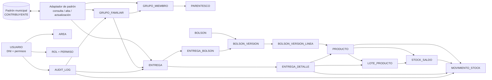

# 02. Modelo de datos

## Principios de diseño

1. **La base municipal es la fuente oficial de contribuyentes.** SIGAS la consulta en vivo y puede crear/actualizar registros allí mediante un adaptador controlado.
2. **MongoDB almacena los datos propios de SIGAS.** No se mantiene una copia local de los contribuyentes en Mongo; una alta o actualización exitosa se confirma en la base municipal y no crea un documento paralelo.
3. **Las referencias al padrón no deben depender de un DNI mutable.** Se debe usar un identificador municipal inmutable si existe; si no existe, esa decisión bloquea el diseño definitivo.
4. **El historial operativo sigue el dato actual del padrón.** La auditoría conserva los valores anteriores y nuevos para reconstruir cambios.
5. **Las invariantes de negocio viven en servicios compartidos.** Deben cumplirse tanto desde el frontend propio como desde Payload Admin.
6. **Los registros históricos no se borran físicamente.** Se desactivan, corrigen con trazabilidad o se compensan mediante nuevos movimientos.

## Propiedad de los datos

| Dato | Sistema propietario | Uso de SIGAS |
|---|---|---|
| Contribuyentes | Base municipal | Consulta y alta/actualización mediante adaptador en vivo |
| Usuarios, autenticación y permisos | MongoDB/Payload | Administración interna |
| Grupos y membresías | MongoDB/SIGAS | Creación y mantenimiento manual |
| Productos, lotes y stock | MongoDB/SIGAS | Operación de Depósito |
| Recetas y versiones de bolsones | MongoDB/SIGAS | Planificación y trazabilidad |
| Entregas y detalles reales | MongoDB/SIGAS | Historial y reportes |
| Auditoría | MongoDB/SIGAS, con protección de escritura | Trazabilidad de todas las acciones sensibles |

## Operaciones contra el padrón

SIGAS no guarda una copia local del contribuyente. Cada alta o actualización se ejecuta contra la base municipal mediante el adaptador y debe registrar en Mongo un resultado técnico de integración, sin convertirse en una fuente alternativa. El ciclo comienza en `solicitada` y termina en un estado final:

- `solicitada`: operación iniciada;
- `confirmada`: la base municipal confirmó el cambio;
- `rechazada`: la base municipal respondió con un error controlado;
- `incierta`: timeout, desconexión o respuesta incompleta impide saber si el cambio se aplicó.

Una operación `incierta` no se reintenta automáticamente sin una clave de idempotencia o una verificación posterior en el padrón. El operador debe ver el estado y no se debe crear un contribuyente paralelo en Mongo.

## Modelo conceptual

El siguiente diagrama no impone tablas relacionales: representa documentos MongoDB y referencias lógicas entre datos propios y el padrón externo.

## Entidades propias de SIGAS

### `CONTRIBUYENTE_MUNICIPAL` — referencia externa

No es un documento propietario de SIGAS. El adaptador debe obtener y validar, como mínimo:

- identificador municipal estable, si existe;
- DNI normalizado;
- CUIT opcional;
- nombre y apellido;
- fecha de nacimiento, si está disponible;
- teléfono, dirección y barrio;
- estado activo/inactivo.

El DNI es el identificador principal para búsqueda de usuario y contribuyente. No debe usarse como referencia técnica dentro de Mongo si puede cambiarse.

Se considera **ID municipal estable** un identificador generado por la base municipal que no cambia cuando se corrige el DNI, nombre o domicilio y que puede ser consultado de forma consistente. Antes de implementar se debe comprobar su existencia, unicidad, inmutabilidad práctica y disponibilidad para lectura/escritura. Si no existe, no se debe usar el DNI como reemplazo silencioso: hay que aprobar una estrategia de identidad alternativa antes de crear referencias en Mongo.

### `USUARIO`

Documento de autenticación y autorización administrado por Payload/Mongo.

Campos conceptuales:

- `id`;
- `dni_login` único y normalizado: sin puntos, espacios ni guiones, solo dígitos y conservando ceros iniciales;
- `nombre`;
- `activo`;
- `requiere_cambio_password`;
- `roles[]`;
- `areas[]` opcionales;
- timestamps y estado de bloqueo.

La contraseña la gestiona el mecanismo de autenticación; nunca se guarda en texto plano ni se incluye en la auditoría.

### `AREA`, `ROL` y `PERMISO`

- `AREA` representa una pertenencia funcional de intervención.
- `ROL` representa una función del sistema, por ejemplo Administrador, Depósito o Gestión de grupos.
- `PERMISO` representa una acción sobre un módulo, por ejemplo `entregas.confirmar` o `stock.ajustar`.

Área y rol son dimensiones independientes. Un usuario transversal puede no pertenecer a un área de intervención.

### `GRUPO_FAMILIAR`

Campos conceptuales:

- `id`;
- `estado`: activo/inactivo;
- `referente_contribuyente_id` — referencia al padrón municipal;
- `fecha_alta`;
- `fecha_baja` y motivo, si corresponde;
- `observaciones`;
- timestamps.

El grupo no mantiene un domicilio propio en el MVP. Para búsquedas y reportes se usa el domicilio/barrio actual del referente en el padrón.

### `GRUPO_MIEMBRO`

Documento de relación entre un grupo y un contribuyente:

- `grupo_id`;
- `contribuyente_id` municipal estable;
- `parentesco_id`;
- `es_referente`;
- `fecha_alta`;
- `fecha_baja` y motivo;
- `observacion`.

Una persona puede pertenecer a varios grupos activos. Al agregarla a otro grupo, el sistema muestra una advertencia bloqueante hasta que el operador revise las membresías existentes, confirme que desea continuar y complete un motivo. La advertencia no impide una segunda pertenencia legítima.

### `PARENTESCO`

Catálogo configurable. Debe incluir opciones institucionales y una opción `otro` con observación.

## Inventario

### `PRODUCTO`

- `id`;
- `nombre`;
- `categoria`;
- `unidad`: unidades enteras en el MVP;
- `controla_lote_vencimiento`: booleano;
- `stock_minimo`;
- `activo`.

### `LOTE_PRODUCTO`

Solo se usa cuando el producto está configurado para control de lote/vencimiento:

- `id`;
- `producto_id`;
- `codigo_lote`;
- `fecha_vencimiento`;
- estado;
- timestamps.

En una entrega, Depósito selecciona manualmente el lote cuando corresponde.

### `STOCK_SALDO`

Saldo actual de un producto, opcionalmente discriminado por lote:

- `producto_id`;
- `lote_id` opcional;
- `cantidad_actual` entera;
- timestamps.

El MVP tiene un único depósito central. El modelo puede conservar `deposito_id` como configuración futura, pero no se implementan subdepósitos ni transferencias en el primer corte.

### `MOVIMIENTO_STOCK`

Libro de movimientos de inventario:

- `id`;
- `producto_id`;
- `lote_id` opcional;
- `tipo`: entrada, salida o ajuste;
- `cantidad` entera;
- `motivo`: compra, donación, entrega, vencimiento, pérdida, rotura o ajuste;
- `fecha_operativa`;
- `creado_en`;
- `usuario_id`;
- `referencia_tipo` y `referencia_id`, por ejemplo una entrega;
- estado de corrección/auditoría.

Los movimientos pueden ser corregidos por usuarios autorizados, pero la modificación conserva valores anteriores y nuevos en `AUDIT_LOG`.

## Bolsones y recetas

### `BOLSON`

Catálogo lógico de tipos de bolsón:

- `id`;
- `nombre`;
- `descripcion`;
- `activo`.

### `BOLSON_VERSION`

Cada cambio de receta crea una versión nueva:

- `id`;
- `bolson_id`;
- `version`;
- `estado`;
- `vigente_desde`;
- `vigente_hasta` opcional;
- `creado_por`.

Las entregas históricas referencian la versión seleccionada; nunca se reescribe la receta usada en el pasado.

### `BOLSON_VERSION_LINEA`

- `version_id`;
- `producto_id`;
- `cantidad_estandar` entera.

## Entregas

### `ENTREGA`

Una entrega es una confirmación efectiva de asistencia. No se modelan estados de solicitud, preparación o no retirada en el MVP.

Campos conceptuales:

- `id`;
- `destino_tipo`: grupo o persona;
- `grupo_id` opcional;
- `destinatario_contribuyente_id` opcional;
- `area_id` opcional;
- `fecha_entrega` flexible;
- `confirmada_en` — fecha/hora real de confirmación;
- `confirmada_por`;
- `receptor_contribuyente_id`;
- `receptor_es_tercero`;
- `motivo_autorizacion_receptor` opcional;
- `motivo_entrega_sin_grupo` opcional;
- `observaciones`.

Reglas:

- Debe existir exactamente un destino: grupo o persona.
- Una entrega individual sin grupo requiere autorización y motivo.
- Una entrega para grupo se retira por un integrante/referente o por un tercero contribuyente autorizado.
- El área es opcional y representa el origen/responsabilidad administrativa de la asistencia, no una intervención del área; los reportes deben separar entregas asignadas y no asignadas.
- Una fecha futura descuenta stock inmediatamente al confirmar; se muestra separada de `confirmada_en`.

### `ENTREGA_BOLSON`

Conserva las recetas seleccionadas en una operación mixta:

- `entrega_id`;
- `bolson_version_id`;
- `cantidad_seleccionada`;
- observación de modificación, si corresponde.

### `ENTREGA_DETALLE`

Conserva el contenido real que salió y genera los movimientos de stock:

- `entrega_id`;
- `producto_id`;
- `lote_id` cuando corresponda;
- `cantidad_real`;
- `origen_bolson_version_id` opcional;
- observaciones.

La receta se expande como propuesta inicial y el operador define explícitamente las líneas reales antes de confirmar. Las líneas de producto son la fuente del descuento real de stock; no se calcula automáticamente una entrega parcial sin intervención del operador.

Una entrega puede tener varias recetas, líneas modificadas y productos sueltos. Las líneas de producto son la fuente del descuento real de stock.

## Auditoría

### `AUDIT_LOG`

Registro inmutable de:

- actor y roles vigentes;
- fecha/hora;
- acción y módulo;
- tipo e identificador del objetivo;
- motivo/contexto;
- valores anteriores y nuevos cuando hubo modificación;
- resultado y error, si correspondiera;
- referencia de sesión o solicitud.

Debe auditar login, altas, cambios, bajas lógicas, permisos, contribuyentes, grupos, stock, entregas, correcciones y accesos a intervenciones sensibles. Nunca registra contraseñas ni secretos.

## Invariantes que deben probarse

- Una entrega no puede quedar sin destino ni con dos destinos incompatibles.
- Toda línea real de entrega tiene producto y cantidad positiva entera.
- Una entrega confirmada genera movimientos de salida consistentes con sus líneas.
- El saldo y el libro de movimientos deben coincidir después de cada operación.
- Una receta histórica no cambia al crear una nueva versión.
- Un tercero receptor debe ser un contribuyente existente y tener autorización registrada.
- Un contribuyente puede tener varias membresías activas, pero cada membresía tiene su propio ciclo de vida.
- Ninguna corrección elimina silenciosamente el valor anterior.
- La referencia a contribuyentes debe usar un ID estable si la base municipal lo provee.

## Bloqueos del modelo

Antes de convertir este modelo en colecciones, índices y servicios se debe confirmar:

1. motor, esquema e identificador estable del padrón municipal;
2. permisos de lectura/escritura y comportamiento de errores;
3. política ante caída del padrón;
4. política de stock insuficiente: entregar lo disponible, sin saldo negativo;
5. corrección de entregas: anular y crear una nueva, con compensación auditada;
6. estrategia de consistencia: estados `confirmada` / `rechazada` / `incierta`.

El primer flujo puede implementarse con adaptador mock. El adaptador real requiere evidencia de Infraestructura.
