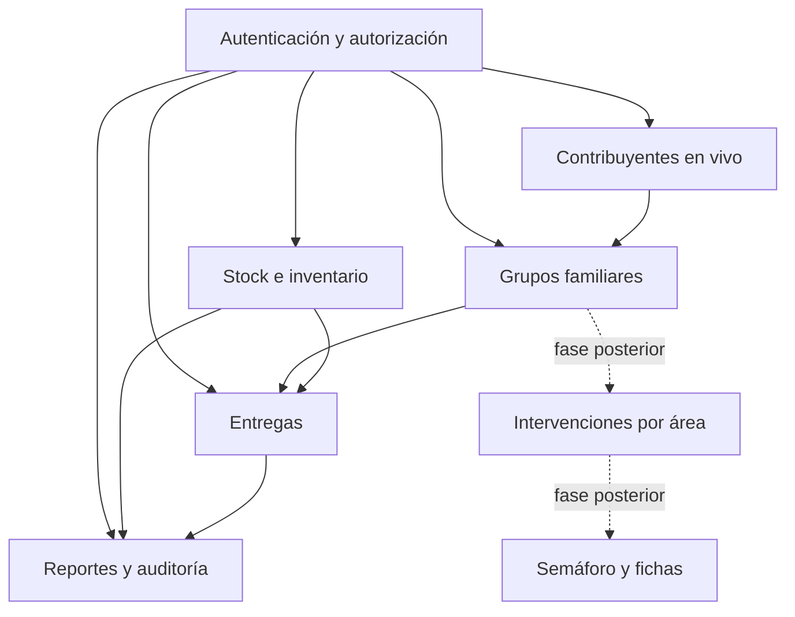

# 03. Módulos funcionales

## Mapa de módulos

Los módulos 1 a 5 conforman el MVP operativo. El módulo 6 es una capacidad transversal de integración necesaria para el MVP, no una pantalla de negocio. Los módulos 7 y 8 quedan para fases posteriores.

## Módulo 1 — Autenticación, usuarios, roles y permisos

**Objetivo:** permitir acceso interno seguro y permisos configurables.

Funciones:

- Login con DNI y contraseña.
- Restablecimiento de contraseña desde Administrador.
- Bloqueo y desbloqueo de cuentas.
- Alta, baja lógica y edición de usuarios.
- Roles y permisos por módulo/acción configurables.
- Área y rol asignados de forma independiente.
- Payload Admin para administración completa.
- Frontend propio para operaciones.
- Auditoría de login, permisos y cambios de usuarios.

Reglas:

- El último Administrador no puede eliminarse ni perder todos sus permisos.
- Las contraseñas nunca aparecen en respuestas, logs ni auditoría.
- Las validaciones de permisos se ejecutan en backend y no solo en el frontend.

## Módulo 2 — Contribuyentes y grupos familiares

**Objetivo:** construir grupos desde el padrón municipal sin duplicar contribuyentes en Mongo.

Funciones:

- Buscar contribuyentes en vivo por DNI, CUIT o datos permitidos.
- Crear y actualizar contribuyentes mediante un adaptador controlado.
- Registrar antes/después, actor, fecha y motivo de cada cambio.
- Crear un grupo manualmente.
- Seleccionar un referente obligatorio.
- Agregar integrantes con parentesco configurable.
- Dar de baja grupos o membresías sin borrar historial.
- Advertir cuando una persona ya pertenece a otro grupo activo y permitir continuar con motivo.
- Consultar el historial de entregas desde la ficha del grupo.
- Usar el domicilio/barrio actual del referente para reportes y búsquedas.

No hace agrupamiento automático por domicilio.

## Módulo 3 — Stock e inventario

**Objetivo:** mantener un saldo confiable del depósito central.

Funciones:

- ABM de productos y categorías.
- Unidad de medida basada en unidades enteras.
- Stock mínimo configurable por producto.
- Control de lote/vencimiento para productos sensibles.
- Entradas por compra o donación.
- Salidas por entrega, vencimiento, pérdida, rotura o ajuste.
- Selección manual de lote en entradas y entregas sensibles.
- Alertas de stock mínimo y vencimiento.
- Historial de movimientos.
- Corrección de movimientos con valores anteriores/nuevos auditados.
- Definición de recetas de bolsones.
- Creación de versiones nuevas cuando cambia una receta.
- Proyección de cuántas unidades de una receta pueden armarse, si la política de stock lo permite.

El MVP tiene un solo depósito central y no implementa transferencias ni subdepósitos.

## Módulo 4 — Entregas

**Objetivo:** registrar una asistencia efectiva y descontar el contenido real del stock.

Una entrega puede incluir simultáneamente:

- varias unidades de un tipo de bolsón;
- varios tipos de bolsón;
- modificaciones de contenido;
- productos sueltos.

Funciones:

- Seleccionar destino grupal o individual.
- Permitir entrega individual sin grupo solo con autorización y motivo.
- Seleccionar receptor físico.
- Exigir que un tercero receptor exista como contribuyente y registrar autorización/motivo.
- Asociar área de asistencia opcional.
- Seleccionar una o varias versiones de bolsón.
- Registrar las líneas reales de producto que salieron.
- Seleccionar lote en productos sensibles.
- Confirmar la entrega desde Depósito.
- Generar movimientos de salida por el contenido real.
- Guardar fecha de entrega, fecha/hora de confirmación, usuario y observaciones.
- Consultar historial por grupo, persona, período, producto, bolsón y área.

El MVP registra entregas efectivas. No incluye solicitudes, reservas, preparaciones ni estados de no retirada.

## Módulo 5 — Reportes y auditoría

Reportes del MVP:

- stock actual por producto;
- productos bajo stock mínimo;
- lotes próximos a vencer;
- movimientos por período y motivo;
- entregas por período;
- entregas por grupo o persona;
- entregas por producto y versión de bolsón;
- entregas por área asignada o sin área;
- entregas por barrio del referente.

La auditoría permite investigar quién hizo cada acción, cuándo, sobre qué dato y con qué valores anteriores/nuevos.

## Módulo 6 — Integración con padrón municipal

**Objetivo:** consultar y actualizar el padrón sin copiarlo a Mongo.

El adaptador debe:

- aislar el esquema externo del resto del sistema;
- normalizar búsquedas por DNI/CUIT;
- usar un ID municipal estable si existe;
- validar duplicados antes de crear;
- aplicar timeouts, reintentos acotados y errores visibles;
- diferenciar una operación confirmada de una operación incierta;
- auditar altas y actualizaciones;
- definir qué operaciones quedan bloqueadas si el padrón no responde.

## Módulo 7 — Intervenciones por área — fase posterior

Cada área podrá registrar intervenciones sobre un grupo o persona y ver el detalle propio. El diseño queda reservado, pero no forma parte del MVP de stock/entregas.

Áreas iniciales previstas:

- Comedores;
- Niñez, Adolescencia y Familia;
- Mujer;
- Discapacidad y Adultos Mayores;
- Acción Social.

## Módulo 8 — Semáforo y fichas — fase posterior

El semáforo futuro mostrará a otras áreas:

- área que intervino;
- última fecha;
- cantidad de intervenciones.

No mostrará descripciones, adjuntos, nombres profesionales ni estados operativos. El Administrador tendrá acceso completo a detalles sensibles, con auditoría obligatoria.

Las fichas, estudios, visitas y adjuntos se definirán cuando las áreas validen sus protocolos.

## Fuera de estos módulos iniciales

- portal ciudadano;
- aplicación móvil nativa;
- mapas;
- programas/expedientes obligatorios;
- contabilidad o compras;
- exportaciones oficiales avanzadas;
- subdepósitos y transferencias;
- automatización de frecuencia de asistencia.
