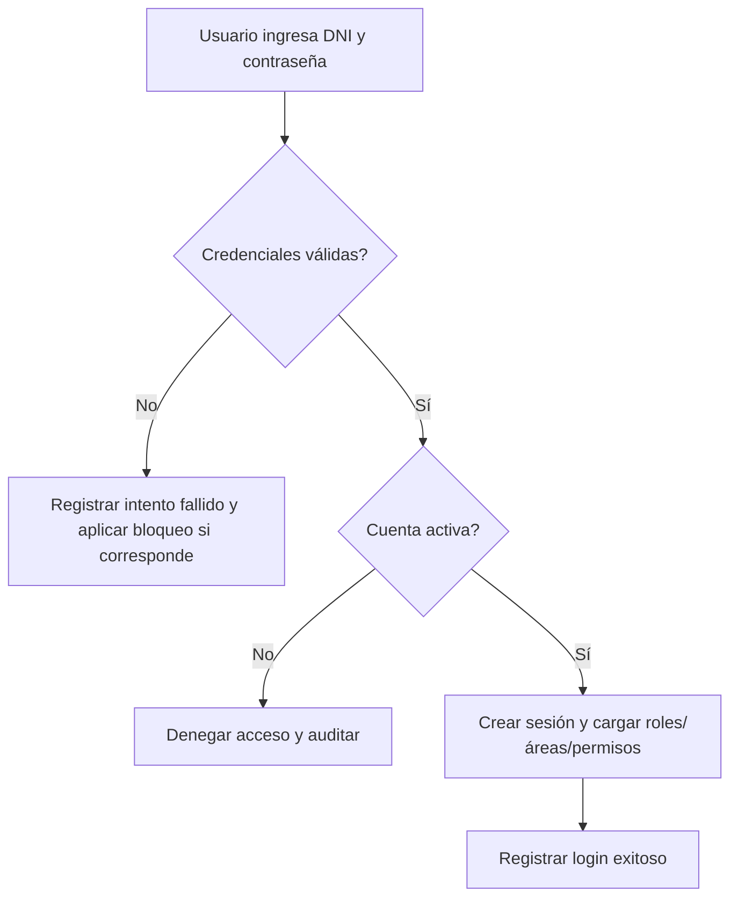
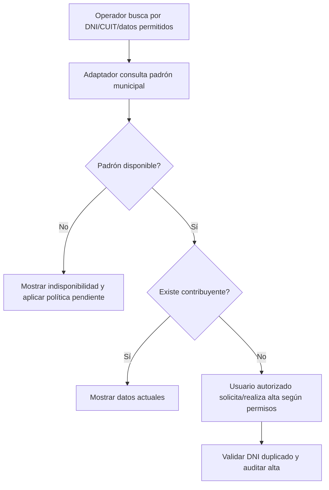
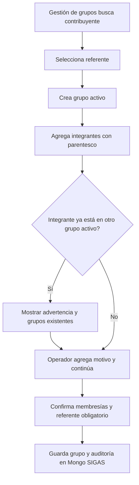
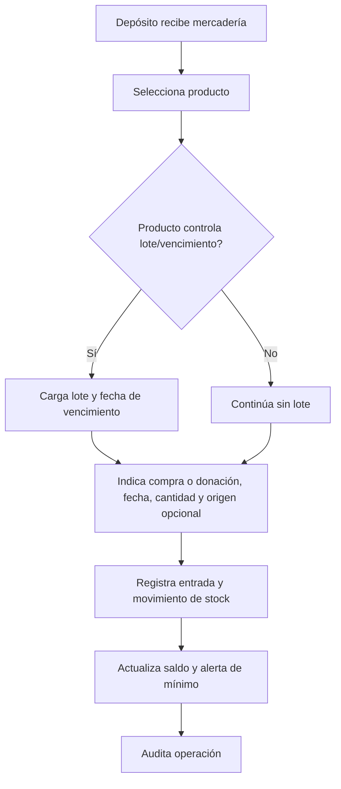
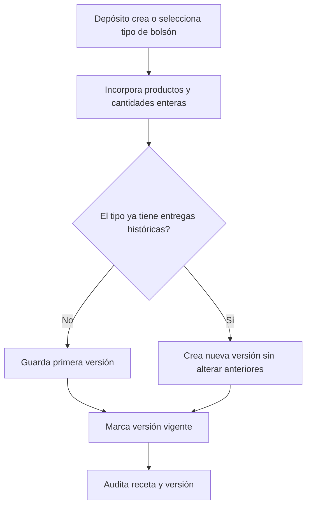
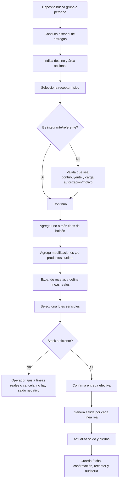
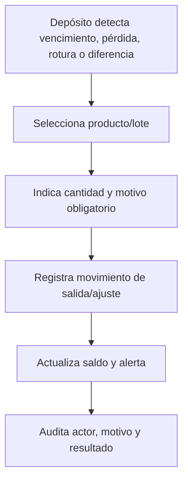
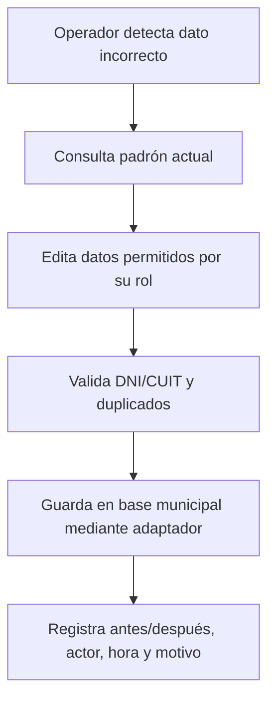
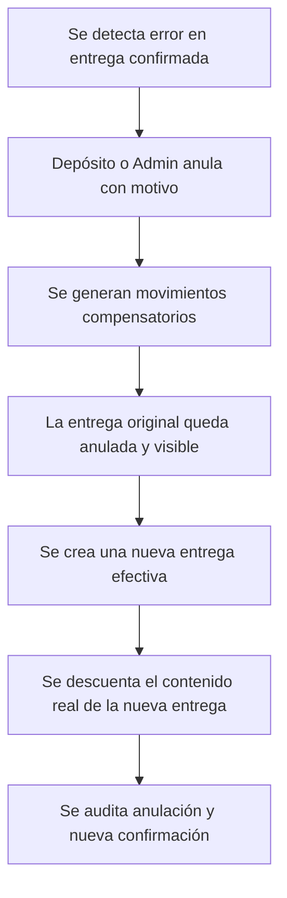

# 05. Flujos de procesos

## Convenciones

- **Padrón municipal:** fuente externa de contribuyentes, consultada en vivo.
- **Mongo SIGAS:** datos propios de grupos, stock, entregas, usuarios y auditoría.
- **Confirmar:** acción que deja un registro efectivo y, en entregas, descuenta stock.
- **Pendiente:** regla que requiere decisión de Depósito, Dirección o Infraestructura y no debe resolverse por supuesto técnico.

## Flujo 0 — Inicio de sesión

La recuperación de contraseña se realiza desde el Administrador. Las contraseñas se almacenan mediante el mecanismo seguro de autenticación y nunca en texto plano.

## Flujo 1 — Buscar contribuyente en vivo

Si el padrón no está disponible se bloquean las operaciones que dependen de contribuyentes. No se usa caché ni carga provisoria.

## Flujo 2 — Crear grupo familiar

El grupo no guarda domicilio propio en el MVP. La ubicación operativa se obtiene del domicilio/barrio actual del referente.

## Flujo 3 — Entrada de mercadería

## Flujo 4 — Definir una receta versionada

## Flujo 5 — Registrar entrega mixta

Una fecha futura sigue descontando stock al confirmar; se conserva por separado la fecha/hora real de confirmación.

## Flujo 6 — Salida no asociada a entrega

## Flujo 7 — Corrección de datos de contribuyente

El adaptador debe diferenciar:

- **confirmada:** la base municipal respondió que el cambio se aplicó;
- **rechazada:** la base municipal respondió con un error controlado y no aplicó el cambio;
- **incierta:** timeout, desconexión o respuesta incompleta impide saber si el cambio se aplicó.

Una operación incierta queda visible para revisión y no se reintenta sin idempotencia o verificación posterior. La estrategia completa de compensación entre la base municipal y Mongo SIGAS queda pendiente.

## Flujo 8 — Corrección de entrega confirmada

La entrega original no se borra ni se edita en silencio.

## Flujo futuro — Intervención y semáforo

Cada área registra intervenciones propias sobre un grupo o persona. Otras áreas ven solo área, última fecha y cantidad. El Administrador ve el detalle completo y los adjuntos sensibles, con auditoría.
