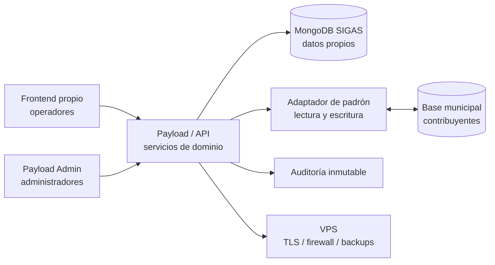

# 07. Especificación y arquitectura del MVP

## Estado del documento

**Estado:** especificación funcional aprobada. Gate 0 cerrado con decisiones de avance para iniciar el primer flujo.

Este documento reúne las decisiones tomadas durante la definición del producto. No habilita por sí solo el comienzo del desarrollo: los bloqueos operativos y de infraestructura de la sección final deben validarse primero.

## Objetivo

Construir un sistema interno para la Dirección de Acción Social que permita crear grupos familiares desde el padrón municipal, administrar el stock de un depósito central y registrar entregas efectivas de asistencia con trazabilidad completa.

## Usuarios y éxito

### Usuarios iniciales

- **Administrador:** acceso total desde Payload Admin, incluyendo usuarios, permisos, contribuyentes, grupos, stock, entregas y auditoría.
- **Gestión de grupos:** administra grupos, integrantes, referentes y parentescos; consulta historial de entregas.
- **Depósito/Stock:** administra inventario, recetas y entregas; consulta grupos y puede corregir contribuyentes.

Área y rol son dimensiones independientes. Las áreas de intervención se incorporan en fases posteriores.

### Éxito verificable

El MVP funciona cuando:

1. un usuario puede ingresar con DNI y contraseña;
2. un operador puede consultar el padrón municipal en vivo;
3. Gestión de grupos puede crear un grupo con referente e integrantes;
4. Depósito puede cargar productos y entradas de compra/donación;
5. Depósito puede definir una receta y crear nuevas versiones;
6. Depósito puede confirmar una entrega mixta a un grupo o persona;
7. el stock se descuenta por las líneas reales entregadas;
8. el historial permite consultar qué se entregó, cuándo, a quién y quién confirmó;
9. los reportes muestran stock actual, mínimos, vencimientos y entregas;
10. las acciones sensibles quedan en una auditoría inmutable.

## Alcance

### Incluido en el MVP

- autenticación interna por DNI/contraseña;
- recuperación administrativa de contraseña;
- roles y permisos granulares configurables;
- usuarios y áreas independientes;
- consulta y escritura controlada sobre contribuyentes municipales;
- grupos manuales con referente obligatorio;
- múltiples membresías activas con advertencia y motivo;
- un depósito central;
- productos con unidades enteras;
- lotes/vencimientos configurables por producto;
- entradas por compra o donación;
- salidas por entrega, vencimiento, pérdida, rotura o ajuste;
- recetas versionadas;
- entregas mixtas de varios bolsones/versiones y productos sueltos;
- destino grupal o individual;
- receptor contribuyente y autorización de terceros;
- área de asistencia opcional;
- fechas de entrega flexibles y confirmación auditada;
- reportes operativos;
- auditoría completa;
- frontend propio para operadores;
- Payload Admin para administración;
- despliegue previsto en VPS.

### No incluido en el MVP

- intervenciones, fichas y adjuntos de las áreas;
- semáforo cruzado;
- solicitudes, reservas, preparaciones o no retirados;
- reglas automáticas de frecuencia;
- múltiples depósitos y transferencias;
- mapas;
- portal ciudadano, turnos o app móvil;
- contabilidad, compras y presupuesto;
- programas/expedientes obligatorios;
- exportaciones oficiales automatizadas.

## Arquitectura propuesta



### Límites de datos

- MongoDB contiene usuarios, roles, grupos, membresías, productos, lotes, saldos, movimientos, recetas, entregas y auditoría.
- La base municipal contiene los contribuyentes y sigue siendo la fuente oficial.
- SIGAS no mantiene una copia local de contribuyentes en Mongo. Las altas y actualizaciones se escriben en la base municipal mediante el adaptador; una operación exitosa no crea un documento paralelo.
- La referencia técnica debe usar un ID municipal inmutable: un identificador único que no cambie al corregir DNI, nombre o domicilio. Si no existe, se debe aprobar una estrategia alternativa antes de crear referencias en Mongo.
- El adaptador de padrón debe aislar el esquema externo y aplicar validación, permisos mínimos, timeout, reintentos acotados, idempotencia y auditoría.
- Los resultados del adaptador son `confirmada`, `rechazada` o `incierta`. Una operación incierta no se reintenta sin idempotencia o verificación posterior.
- No se asume una transacción distribuida entre Mongo y la base municipal. La estrategia de fallos, compensación y resultados inciertos debe estar definida antes del código.

### Stack provisional

| Capa | Propuesta | Estado |
|---|---|---|
| Backend/admin/auth | Payload CMS | Candidato |
| Base propia | MongoDB | Preferencia confirmada |
| Operación | Frontend propio | Confirmado |
| Padrón | Adaptador a base municipal en vivo | Confirmado conceptualmente |
| Hosting | VPS | Destino confirmado; proveedor y conectividad pendientes |
| Login | DNI + contraseña | Confirmado; requiere estrategia de login personalizada |

La estrategia prevista para el login es una colección de usuarios de Payload con DNI normalizado y único, manteniendo el hash y el restablecimiento de contraseña dentro del mecanismo de autenticación. El adaptador de login debe resolver el DNI contra el usuario y reutilizar las protecciones de sesión, bloqueo y auditoría de Payload; no se implementará un almacén paralelo de contraseñas.

Payload tiene adaptador oficial para MongoDB. El primer flujo ya está iniciado en `app/` con adaptador mock del padrón.

```bash
cd app
cp .env.example .env
npm install
npm test
npm run dev
```

## Estructura propuesta del proyecto

La estructura final depende del stack aprobado, pero debe separar responsabilidades:

```text
app/
  backend/          Payload, servicios de dominio y adaptadores
  frontend/         interfaz propia para operadores
  collections/      modelos de datos propios de SIGAS
  integrations/     adaptador del padrón municipal
  auth/             login DNI, sesiones y permisos
  audit/            auditoría inmutable
  reports/          consultas y reportes operativos
  tests/            unitarias, integración y aceptación
  docs/             especificación y decisiones
```

El adaptador de padrón no debe filtrarse directamente en las pantallas ni en las colecciones de Mongo.

## Contratos funcionales principales

### Crear grupo

**Entrada:** referente, integrantes, parentescos y observación opcional.

**Reglas:**

- el referente es obligatorio y debe ser integrante;
- cada integrante debe ser un contribuyente válido;
- una pertenencia activa en otro grupo genera una advertencia que debe ser revisada y confirmada por el operador;
- continuar con múltiples pertenencias requiere motivo;
- el grupo se guarda en Mongo, no en el padrón;
- la baja es lógica y conserva historial.

### Confirmar entrega

**Entrada:** destino, receptor, fecha, área opcional, líneas de bolsones/versiones y productos reales.

**Reglas:**

- el destino es grupo o persona, nunca ambos como beneficiario principal;
- una persona sin grupo requiere autorización y motivo;
- un tercero receptor debe existir como contribuyente y tener autorización;
- una operación puede mezclar varios bolsones/versiones y productos sueltos;
- los lotes se seleccionan manualmente para productos sensibles;
- la receta se expande como propuesta y el operador define explícitamente las líneas reales antes de confirmar;
- se descuenta por las líneas reales, no por la receta teórica;
- la fecha futura descuenta inmediatamente al confirmar;
- se guarda fecha de entrega y fecha/hora de confirmación por separado;
- la auditoría registra actor, contexto y resultado.

### Actualizar contribuyente

**Entrada:** referencia municipal, campos modificados y motivo.

**Reglas:**

- cualquier operador habilitado puede corregir todos los campos;
- se valida DNI/CUIT y duplicados;
- se escribe mediante el adaptador del padrón;
- se conserva antes/después, actor y timestamp;
- no se registran contraseñas ni secretos;
- un resultado incierto no se reintenta automáticamente sin idempotencia.

## Criterios no funcionales

- **Seguridad:** TLS, sesiones seguras, contraseñas con hash, permisos backend, mínimo privilegio y auditoría.
- **Integridad:** movimientos y líneas reales deben actualizar el saldo de forma consistente dentro de Mongo.
- **Trazabilidad:** ninguna corrección elimina silenciosamente el valor anterior.
- **Disponibilidad:** definir qué funciones quedan bloqueadas si el padrón no responde.
- **Recuperación:** backups automáticos del VPS/Mongo y pruebas periódicas de restauración.
- **Privacidad:** acceso a datos sensibles auditado; el Administrador tiene acceso completo por decisión del proyecto.
- **Usabilidad:** operaciones de Depósito y Gestión de grupos deben estar guiadas por pantallas propias, no por edición directa de documentos crudos.

## Estrategia de pruebas

Antes de tener comandos definitivos, se define el alcance de pruebas:

### Unitarias

- normalización y validación de DNI/CUIT;
- permisos por rol/área/acción;
- cálculo de líneas reales desde recetas;
- cálculo de saldo y mínimos;
- validación de destino y receptor;
- versionado de recetas;
- reglas de pertenencia múltiple.

### Integración

- adaptador contra un entorno controlado del padrón municipal;
- lecturas y escrituras idempotentes;
- errores, timeouts y reintentos;
- operaciones de entrega y movimientos Mongo en una transacción;
- auditoría de antes/después.

### Aceptación

- login de cada perfil;
- creación de grupo;
- entrada de compra/donación;
- receta versionada;
- entrega mixta a grupo;
- entrega individual autorizada;
- tercero receptor;
- reportes de stock y entregas;
- acceso administrativo completo y auditado.

### Seguridad

- usuario sin permiso no puede ejecutar la acción por API aunque oculte el botón;
- un operador no puede modificar membresías si solo tiene permiso de Depósito;
- un tercero no contribuyente no puede ser receptor;
- las contraseñas y secretos no aparecen en logs;
- no se puede borrar la auditoría desde la aplicación.

Los comandos actuales están en `app/package.json`: `npm run dev`, `npm test`, `npm run build` y `npm run lint`.

## Límites de trabajo

### Siempre

- validar entradas y permisos en backend;
- auditar acciones sensibles;
- usar referencias estables para contribuyentes;
- conservar historial y bajas lógicas;
- probar invariantes de stock y entregas;
- mantener la documentación actualizada cuando cambie una decisión.

### Consultar antes

- cambiar el esquema municipal;
- modificar el padrón desde SIGAS;
- cambiar la política de stock insuficiente;
- corregir/revertir entregas confirmadas;
- agregar dependencias o cambiar Payload/Mongo;
- exponer la base municipal o cambiar firewall/VPS;
- alterar permisos de datos sensibles.

### Nunca

- guardar contraseñas en texto plano;
- duplicar silenciosamente el padrón;
- borrar entregas, movimientos, grupos o auditoría con historial;
- confiar solo en controles del frontend;
- exponer credenciales o datos personales en logs;
- iniciar código de negocio con los bloqueos de la sección siguiente sin resolver.

## Bloqueos antes de implementar

Cerrados para el primer flujo:

1. **Padrón municipal:** se implementa un adaptador con mock. El motor, esquema, ID estable, permisos y conectividad reales se validan antes de producción. Ver `docs/08-CONTRATO-PADRON-MUNICIPAL.md`.
2. **Caída del padrón:** se bloquean operaciones que dependan de contribuyentes. No hay caché ni carga provisoria.
3. **Stock insuficiente:** se ajustan las líneas reales y se entrega solo lo disponible. No hay saldo negativo.
4. **Corrección de entrega:** se anula y se crea una nueva. La original no se borra.
5. **Consistencia Mongo/padrón:** resultados `confirmada` / `rechazada` / `incierta`; una operación incierta no se reintenta sin verificación.
6. **Colecciones propias:** SIGAS usa MongoDB propio.

Siguen pendientes para producción, no para el primer flujo:

- evidencia sanitizada del padrón real;
- backups, recuperación y retención institucionales;
- validación formal de Depósito/Dirección/Infraestructura.

## Aprobación

La especificación queda lista para revisión cuando:

- la Dirección confirme el alcance y perfiles;
- Depósito confirme las reglas de faltantes y correcciones;
- Infraestructura confirme motor, ID, permisos, conectividad y backups;
- se apruebe Payload/Mongo o se documente una alternativa;
- se aprueben los criterios de aceptación;
- el usuario confirme explícitamente que se puede comenzar a convertir el plan en tareas de implementación.
